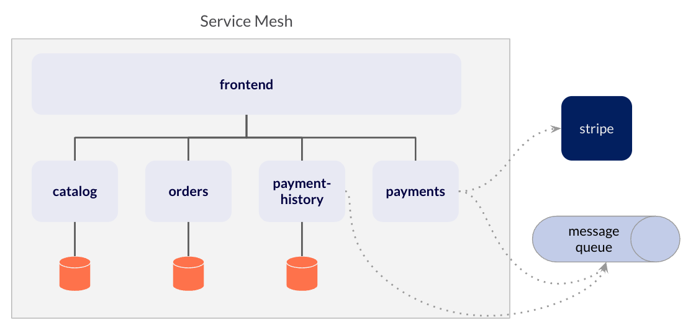

# ecommerce-demo

This is an example application to demonstrate Microservice constructs, such as:

- Microservices with Spring Boot
- RESTful clients and servers
- Database per microservice design
- Loose coupling through messaging

## Databases
There are microservices that use a database:
- [catalog](catalog)
- [orders](orders)
- [payment-history](payment-history)

By default these microservices use an embedded H2 database in each microservice. You can also configure these to use Yugabyte. To do so, set the following environment variables before starting:
- `YB_URL` - the JDBC URL for Yugabyte
- `YB_USER`- the username for Yugabyte
- `YB_PASSWORD` - the password for the Yugabyte user

And then set your Spring profile to `yugabyte`:
```bash
export SPRING_PROFILES_ACTIVE=yugabyte
```
## How to run the projects

### Kubernetes

These microservices can be run in Kubernetes. There is a Helm chart available to install the e-commerce demo. Instructions for using the Helm chart are available [here](https://btjimerson.github.io/btjimerson-charts/).

The orders project uses the Stripe API to process credit cards. You will need to create a free developer account at the [Stripe Developer Dashboard](https://dashboard.stripe.com/register). Once you have your Stripe API key, override the `payments.stripeApiKey` value in the Helm chart. Make sure you Base64 encode your key in the value:
```bash
echo 'my-key' | base64
```

You will also want an Istio Gateway or a Load Balancer service for frontend to access the site. The Helm chart has values that you can override (`frontendlb.enabled` and `frontendgw.enabled`) to control creation of these objects.

### Locally

If you don't have a local Kubernetes cluster like kind or minikube, you can run the applications standalone. Here are the basic steps:

- Install a local instance of RabbitMQ, and set an environment variable called `RABBITMQ_HOST` to something like `localhost`.
- Add an environment variable `STRIPE_API_KEY` with your Stripe API key for the [payments](payments) project. This should be plain text, not encoded.
- Start each project with Maven and a local Spring profile: `mvn clean package spring-boot:run -Dspring-boot.run.profiles=local`.

## Testing

You can use the frontend project to test placing an order. For successful charges, you can use these test credit cards. Using other card numbers, an invalid month (e.g. 13), a year in the past, or a two digit cvc will cause a failure.

| NUMBER           | BRAND                       | CVC          | DATE            |
|------------------|-----------------------------|--------------|-----------------|
| 4242424242424242 | Visa                        | Any 3 digits | Any future date |
| 4000056655665556 | Visa (debit)                | Any 3 digits | Any future date |
| 5555555555554444 | Mastercard                  | Any 3 digits | Any future date |
| 2223003122003222 | Mastercard (2-series)       | Any 3 digits | Any future date |
| 5200828282828210 | Mastercard (debit)          | Any 3 digits | Any future date |
| 5105105105105100 | Mastercard (prepaid)        | Any 3 digits | Any future date |
| 378282246310005  | American Express            | Any 4 digits | Any future date |
| 371449635398431  | American Express            | Any 4 digits | Any future date |
| 6011111111111117 | Discover                    | Any 3 digits | Any future date |
| 6011000990139424 | Discover                    | Any 3 digits | Any future date |
| 3056930009020004 | Diners Club                 | Any 3 digits | Any future date |
| 36227206271667   | Diners Club (14 digit card) | Any 3 digits | Any future date |
| 3566002020360505 | JCB                         | Any 3 digits | Any future date |
| 6200000000000005 | UnionPay                    | Any 3 digits | Any future date |

## API
The [frontend](frontend) application exposes a number of API endpoints for automation\.The API documentation can be viewed [here](https://documenter.getpostman.com/view/1749839/UVyxQtit).


## Architecture


